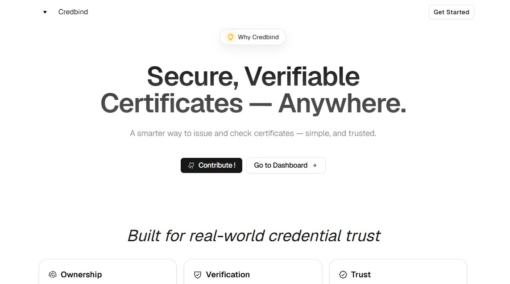

# CredBind



CredBind is a credential issuance and verification platform built for academic and institutional use cases. It allows approved issuers to generate tamper-evident credentials, anchor them to IPFS, and lets third parties verify both credential integrity and holder ownership.

## Why CredBind

Traditional credential workflows are often hard to verify and easy to forge. CredBind provides:

- A registry-backed credential lifecycle.
- IPFS-anchored credential payloads.
- Challenge-response proof of ownership by the holder.
- Role-based authentication and auditable actions.

## Core Features

- Dual-role auth: Issuer and Student (Holder) signup/login.
- Domain-gated issuer onboarding via whitelist.
- Issuer approval flow support (pending/approved/rejected state).
- Credential issuance pipeline with IPFS upload (Pinata).
- Registry + IPFS consistency checks during verification.
- Challenge/nonce-based ownership proof using holder public keys.
- Audit logs for key account and credential actions.
- Credential lifecycle states (active, revoked, expired, suspended-ready model).

## How It Works

1. Holder creates an account and stores public key details.
2. Issuer signs up (domain-checked) and gets approved.
3. Issuer issues a credential to a holder wallet identity.
4. Credential payload is pinned to IPFS and CID is stored in registry.
5. Verifier checks a CID against both registry and IPFS payload.
6. Verifier can request a challenge and validate holder signature proof.

## Tech Stack

- Framework: Next.js (App Router) + React + TypeScript
- Backend API: Next.js Route Handlers
- Database ORM: Prisma
- Database: PostgreSQL
- Storage Layer: IPFS via Pinata
- Auth: JWT + bcrypt password hashing
- UI: Tailwind CSS + component-based design system
- Analytics: Vercel Analytics

## Project Structure

```text
src/
	app/
		layout.tsx
		page.tsx
		not-found.tsx
		globals.css
		login/
			page.tsx
		signup/
			page.tsx
		api/
			auth/          # issuer/holder auth endpoints
			credentials/   # issue and list credentials
			verify/        # CID verification + challenge/prove flow
	components/
		analytics/
			Visitors.tsx
		common/
			Navbar.tsx
			Footer.tsx
			Container.tsx
		landing/
			Hero.tsx
			Cards.tsx
			Steps.tsx
		verify/
			VerifyForm.tsx
		ui/              # reusable UI primitives
		svgs/            # custom icon components
	config/            # frontend content/config constants
	lib/               # frontend helpers and shared utilities
prisma/
	schema.prisma      # database schema and enums
public/
	credbind.jpg       # README/landing preview image
```

## Want to contribute?

### 1. Install dependencies

```bash
npm install
```

### 2. Configure environment variables

Create a `.env` file in the project root:

```env
DATABASE_URL="postgresql://..."
JWT_SECRET="your-strong-random-secret"
PINATA_JWT="your-pinata-jwt"
```

### 3. Generate Prisma client and run migrations

```bash
npx prisma generate
npx prisma migrate dev
```

### 4. Start development server

```bash
npm run dev
```

Open `http://localhost:3000`.

## Available Scripts

- `npm run dev` - Start development server
- `npm run build` - Generate Prisma client and build app
- `npm run start` - Run production server
- `npm run lint` - Run ESLint

## API Overview

Representative endpoint groups:

- `POST /api/auth/holder/signup`
- `POST /api/auth/holder/login`
- `POST /api/auth/issuer/signup`
- `POST /api/auth/issuer/login`
- `POST /api/credentials/issue`
- `GET /api/credentials/mine`
- `GET /api/verify/:cid`
- `POST /api/verify/challenge`
- `POST /api/verify/prove`

## Data Model Highlights

Main entities in the Prisma schema:

- Issuer
- Student
- Credential
- Revocation
- DomainWhitelist
- AuditLog
- VerificationChallenge

## Security Notes

- Passwords are hashed before persistence.
- Sensitive endpoints require JWT authorization.
- Issuer issuance is restricted to approved issuer accounts.
- Ownership proof uses short-lived nonce challenges to reduce replay risk.

## Current Status

This project is under active development. The base issuance and verification pipeline is implemented and can be extended with admin tooling, revocation dashboards, and richer credential schemas.

## License

This repository currently follows the project-level license configuration.
